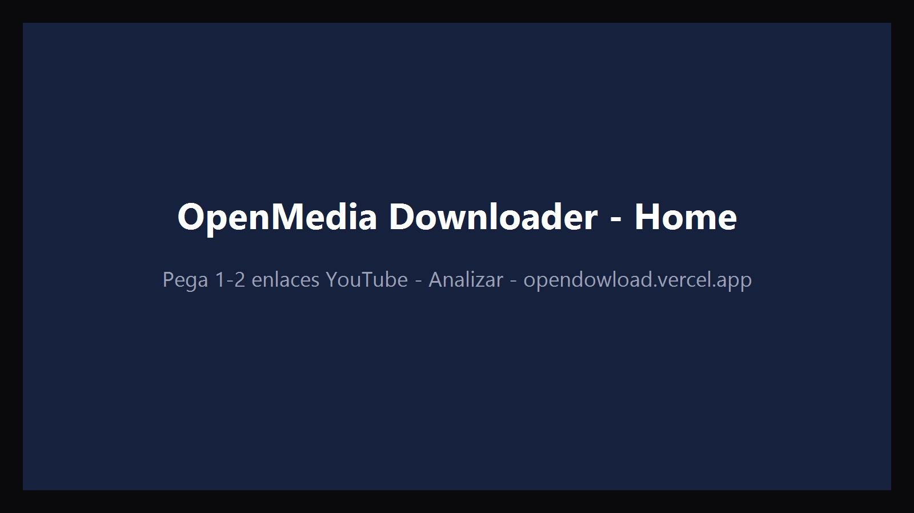
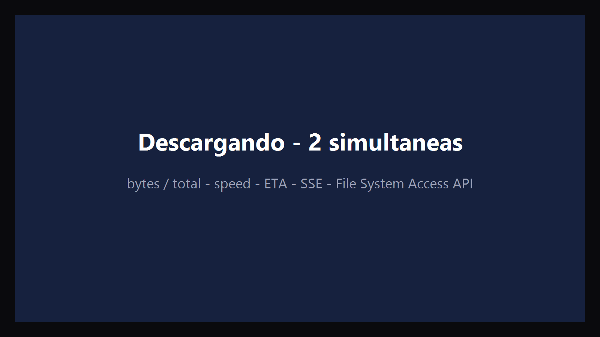

# OpenMedia Downloader

[](https://opendowload.vercel.app)
[](https://nodejs.org)
[](https://vitejs.dev)
[](https://react.dev)

Plataforma web para descargar audio/video (hasta **2 simultáneas**) desde YouTube con **yt-dlp + FFmpeg**. Arquitectura híbrida sin dominio: **frontend en Vercel** + **backend local en tu PC vía Cloudflare Quick Tunnel** — el archivo se guarda directo en tu equipo con **File System Access API** (fallback a descarga clásica).

> **Uso responsable:** solo contenido con permiso. No evade DRM.

## Screenshots

| Home — input 1-2 enlaces | Analizando — tarjetas READY | Descargando — progreso real | Producción — INICIAR.bat |
|---|---|---|---|
|  |  |  |  |

> Reemplaza los placeholders en `docs/screenshots/*.png` con capturas reales (1600×900). Live: https://opendowload.vercel.app

## Arquitectura

```
Vercel (React+Vite)  --HTTPS-->  Cloudflare Tunnel  --HTTPS-->  PC (Express :3001)
                                                                    ├─ Queue MAX=2 (global + por IP)
                                                                    ├─ yt-dlp / FFmpeg (spawn array, sin shell)
                                                                    ├─ TEMP_DIR/<uuid> (streaming, TTL 10m, cleanup finish/close)
                                                                    └─ SQLite (historial) + SSE progreso
         │ streaming (createReadStream -> res) │
         └──────── File System Access API ─────►  C:\Musica\... (showSaveFilePicker) o fallback <a download>
```

- **Frontend** (`client/`) React 19 + Vite 8 + Tailwind 4, `DownloadManager` singleton con máquina de estados (`IDLE→VALIDATING→ANALYZING→READY→WAITING_FOR_DESTINATION→DOWNLOADING→COMPLETED/CANCELLED/ERROR/RETRYING`), progreso real (bytes/total/speed/ETA), `AbortController`, doble-clic bloqueado.
- **Backend** (`server/`) Node 22+ `node:sqlite`, Express, `MAX_CONCURRENT=2` (autoridad), `MAX_PER_IP=2`, rate-limit, allowlist YouTube + SSRF, `TEMP_DIR` único por tarea.

## Requisitos

- Node.js 22.5+ (`node:sqlite`)
- yt-dlp (`pip install -U yt-dlp`) y FFmpeg (portable en `tools/ffmpeg` sin admin)
- cloudflared (para producción) — https://developers.cloudflare.com/cloudflare-one/connections/connect/downloads/

## Desarrollo

```bash
git clone https://github.com/progamins/opendowload.git
cd opendowload
npm run install:all
cp server/.env.example server/.env
cp client/.env.example client/.env
# Edita client/.env: VITE_API_URL=http://127.0.0.1:3001/api
npm run dev
# API http://127.0.0.1:3001  WEB http://127.0.0.1:5173
```
O doble clic **`INICIAR.bat` → [1] Desarrollo**.

## Producción — 100% Automático (Vercel + Tunnel)

**No copias URLs a mano. No editas Vercel. No tocas VITE_API_URL.**

```
INICIAR.bat → [2] Producción
      │
      ├─ verifica Node / yt-dlp / FFmpeg / cloudflared / Git / rama
      ├─ compila server, mata :3001 anterior, inicia Express, espera /health
      ├─ inicia cloudflared tunnel --url http://127.0.0.1:3001 --no-autoupdate
      ├─ detecta URL REAL con regex https://[a-z0-9-]+\.trycloudflare\.com (60s, PowerShell, ignora "Requesting new quick Tunnel...")
      ├─ valida https://xxxxx.trycloudflare.com/health = 200 (10 intentos)
      ├─ escribe client/public/config.json → {"apiUrl":"https://xxxxx.trycloudflare.com/api"}
      ├─ git add + commit + push origin main (solo si cambió)
      ├─ Vercel despliega solo, polling https://opendowload.vercel.app/config.json (120s)
      └─ abre https://opendowload.vercel.app — Backend y Tunnel quedan minimizados
```

**Nueva URL en cada reinicio:** el script detecta automáticamente la nueva y hace push. Frontend usa `localStorage > /config.json > VITE_API_URL > localhost (solo dev)`, así Vercel siempre sirve la última sin rebuild manual de env.

Manual (solo si quieres):
```bash
npm run build --prefix server
npm run start --prefix server # :3001
cloudflared tunnel --url http://127.0.0.1:3001
```

## CORS

`server/.env`:
```env
ALLOWED_ORIGINS=http://127.0.0.1:5173,http://localhost:5173,https://opendowload.vercel.app,https://*.vercel.app
API_KEY= # opcional, si lo pones envía X-API-Key (no uses VITE_*)
```

## Variables de entorno

**`server/.env.example`:**
```env
PORT=3001
HOST=127.0.0.1
TEMP_DIR=../temp
LOG_DIR=../logs
DATABASE_PATH=../data/app.db
MAX_CONCURRENT_DOWNLOADS=2
YTDLP_PATH=yt-dlp
FFMPEG_PATH=ffmpeg
ALLOWED_ORIGINS=http://127.0.0.1:5173,http://localhost:5173
API_KEY=
```
**`client/.env.example`:**
```env
VITE_API_URL=http://127.0.0.1:3001/api
# Producción usa client/public/config.json (runtime), VITE_API_URL es fallback
```

## Endpoints

- `GET /health` → `{ok, service, ytDlp, ffmpeg, queue:{active,pending,max}}`
- `POST /analyze` y `POST /analyze/batch` (1-2 URLs)
- `POST /download` → encola, `429` si `active+pending>=2` o por IP
- `GET /downloads/:id/file` → `createReadStream`, `Content-Disposition: attachment; filename*=UTF-8`, cleanup `finish/close`
- `POST /downloads/:id/cancel` → `AbortController` + `kill(SIGTERM)` + `rm -rf temp/<id>`
- `GET /api/events` SSE progreso

## Flujo descarga (2 simultáneas)

```
Pega 1-2 enlaces → Analizar → tarjetas
→ Descargar → showSaveFilePicker() → elige D:\Musica
→ backend TEMP/<uuid> → yt-dlp → FFmpeg → stream → WritableStream → archivo local
→ fallback <a download> si no hay File System Access API
```

## Scripts

- `INICIAR.bat` — [1]Desarrollo [2]Producción [3]Diagnóstico [4]Detener [5]Salir
- `DIAGNOSTICO.bat` — checks Node/yt-dlp/FFmpeg/cloudflared/TEMP/puerto/CORS
- `npm run dev` → concurrently server+client
- `npm run build` / `npm run start`

## Seguridad

- `spawn` con array, nunca `exec(userInput)`
- `sanitizeFileName` + `safeResolveInDir` (TEMP_DIR jail)
- Allowlist YouTube (`youtube.com, youtu.be, music.youtube.com, m.youtube.com`)
- Rate limit por IP/endpoint
- Sin `*` CORS, `API_KEY` nunca en `VITE_*`

## Limitaciones

- File System Access API solo Chromium; Firefox/Safari usan fallback.
- 2 `showSaveFilePicker` requieren 2 gestos; `Descargar ambas` pide ubicación secuencialmente.
- Quick Tunnel URL es efímera; `INICIAR.bat` la rota automáticamente.
- Mantén yt-dlp/FFmpeg actualizados.

## Licencias

Código propio. Dependencias ver `THIRD_PARTY_LICENSES.md`. Portfolio: https://progamins.github.io — proyecto **OpenMedia Downloader** destacado como PROJ. 01.
